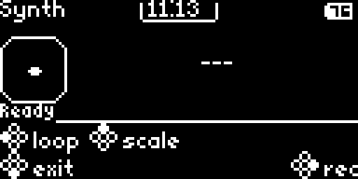

# Temporal Replay 2026 Badge

Public source for the Temporal Replay 2026 Badge at `badge.temporal.io`:
firmware, hardware design files, flashing tools, badge apps, release metadata,
and the static documentation site.



This repository is for people who want to flash a badge, build a badge app,
study or modify the firmware, review the hardware package, or contribute fixes
back through GitHub pull requests. Backend services and private event operations
tooling are intentionally not part of this public repo.

## Choose Your Path

| I want to... | Start here |
|---|---|
| Use or reflash a badge | [Get Started](https://badge.temporal.io/get-started), then [`ignition/README.md`](ignition/README.md) |
| Write a MicroPython badge app | [Developer Guide](https://badge.temporal.io/developer-guide), [Apps](https://badge.temporal.io/apps), and [`firmware/initial_filesystem/apps/README.md`](firmware/initial_filesystem/apps/README.md) |
| Change firmware | [`firmware/README.md`](firmware/README.md) and [`firmware/src/README.md`](firmware/src/README.md) |
| Understand flashing and storage | [`ignition/README.md`](ignition/README.md) and [`firmware/docs/STORAGE-MODEL.md`](firmware/docs/STORAGE-MODEL.md) |
| Work with hardware files | [`hardware/README.md`](hardware/README.md) |
| Update public schedule, floor, or speaker data | [`data/README.md`](data/README.md) |
| Update Community Apps metadata | [`registry/README.md`](registry/README.md) |
| Contribute a fix | Open a pull request against `temporal-community/badge.temporal.io`; see [Contributing](#contributing) below. |

## Repository Map

| Path | What It Contains | Start Here |
|---|---|---|
| [`docs/`](docs/) | Static public documentation site for badge users and contributors. | Visit [badge.temporal.io](https://badge.temporal.io/) or open [`docs/index.html`](docs/index.html) locally. |
| [`firmware/`](firmware/) | PlatformIO firmware project for the ESP32-S3 badge, including native C++ screens, MicroPython embedding, OTA, Doom, and the badge filesystem source. | [`firmware/README.md`](firmware/README.md) |
| [`registry/community_apps/`](registry/community_apps/) | Installable MicroPython community app folders that are published in the Community Apps registry but not preloaded into the factory filesystem. | [`registry/README.md`](registry/README.md) |
| [`ignition/`](ignition/) | Temporal-powered build and flashing system built to bulk flash the badge fleet, also useful for one badge. | [`ignition/README.md`](ignition/README.md) |
| [`hardware/`](hardware/) | Public KiCad projects, fabrication outputs, mechanical references, artwork, and board renders from the final hardware package. | [`hardware/README.md`](hardware/README.md) |
| [`data/`](data/) | Public schedule, speaker, and floor data plus the generated bundle embedded by firmware. | [`data/README.md`](data/README.md) |
| [`registry/`](registry/) | Community Apps registry JSON fetched by badges over WiFi. | [`registry/README.md`](registry/README.md) |
| [`release-assets/`](release-assets/) | Notes for OTA and factory image release artifacts. | [`release-assets/README.md`](release-assets/README.md) |
| [`licenses/`](licenses/) | Third-party license texts and notices for bundled non-MIT components. | [`THIRD_PARTY_NOTICES.md`](THIRD_PARTY_NOTICES.md) |
| [`.github/workflows/`](.github/workflows/) | CI release workflow that builds `firmware.bin` and `replay2026-factory-16MB.bin`. | [`.github/workflows/release-firmware.yml`](.github/workflows/release-firmware.yml) |
| [`CONTRIBUTING.md`](CONTRIBUTING.md) | Pull request guidance and change-type checks. | [`CONTRIBUTING.md`](CONTRIBUTING.md) |

## Quick Start

Ignition is the Temporal-powered system we built to bulk flash the Replay 2026
badge fleet. It runs locally and is the default flashing path for one badge or
a connected batch of badges:

```bash
cd ignition
./setup.sh
./doctor.sh
./start.sh -e replay2026 --firmware-dir ../firmware
```

To preload WiFi during an Ignition build, pass credentials on the command line
or create an ignored `firmware/wifi.local.env` from
[`firmware/wifi.local.env.example`](firmware/wifi.local.env.example):

```bash
./start.sh -e replay2026 --firmware-dir ../firmware \
  --wifi-ssid "YourNetwork" --wifi-pass "YourPassword"
```

Developers who want the lower-level path can use PlatformIO directly:

```bash
cd firmware
pio run -e replay2026
pio run -e replay2026 -t upload
pio run -e replay2026 -t uploadfs
```

For a prebuilt release, download `replay2026-factory-16MB.bin` from
[GitHub Releases](https://github.com/temporal-community/badge.temporal.io/releases).
A factory flash restores firmware and filesystem contents and wipes existing
on-badge data; see [`release-assets/README.md`](release-assets/README.md) for
release artifact context. Flash downloaded factory images with Ignition:

```bash
cd ignition
./start.sh --no-build --factory-image ~/Downloads/replay2026-factory-16MB.bin
```

## Firmware Releases

Public releases include two firmware artifacts:

- `firmware.bin`: application image consumed by badge OTA.
- `replay2026-factory-16MB.bin`: complete factory image with bootloader,
  partition table, firmware, FAT filesystem, and bundled shareware Doom data.

The badge OTA updater checks GitHub Releases in
`temporal-community/badge.temporal.io` for `firmware.bin`.

## Licensing

Temporal-authored source, docs, firmware glue, website content, and hardware
files use the MIT License unless a file or notice says otherwise.

Firmware builds that include Doom also include DoomGeneric engine code and the
bundled `doom1.wad` shareware game data. Those components have separate terms;
see [`THIRD_PARTY_NOTICES.md`](THIRD_PARTY_NOTICES.md) and [`licenses/`](licenses/).

## Generated Artifacts

Some generated files are committed because the firmware or public release flow
consumes them directly:

| Path | Source of truth | Commit? |
|---|---|---|
| `data/out/bundle.bin` and `data/out/*.json` | `data/in/` via `data/build-data.py` | Yes |
| `firmware/data/` | `firmware/initial_filesystem/` via `firmware/scripts/generate_startup_files.py` | No, it is a local build mirror |
| `registry/community_apps.json` | `registry/community_apps/` plus curated registry assets via `firmware/scripts/generate_startup_files.py` | Yes |
| `firmware/.pio/`, `ignition/.venv/`, local logs, and WiFi files | Local machine state | No |
| `firmware.bin` and `replay2026-factory-16MB.bin` | GitHub release workflow | Release assets only |

## Contributing

Pull requests are welcome. Good public contributions include docs fixes,
MicroPython examples, badge apps, firmware fixes, Ignition improvements,
hardware documentation corrections, data updates, and registry updates.
See [`CONTRIBUTING.md`](CONTRIBUTING.md) for change-type checklists.

Before opening a PR:

- Keep changes focused and explain what you tested.
- Link related docs when you add or change a workflow.
- Do not commit credentials, local WiFi settings, virtualenvs, PlatformIO build
  output, caches, or private event operations context.
- For firmware changes, include the relevant PlatformIO build or flash command
  you ran.
- For docs-only changes, check that links resolve from the repo root and the
  static docs site still opens from `docs/index.html`.

Use GitHub issues or PR discussion for questions, bug reports, and proposed
app or documentation changes.
