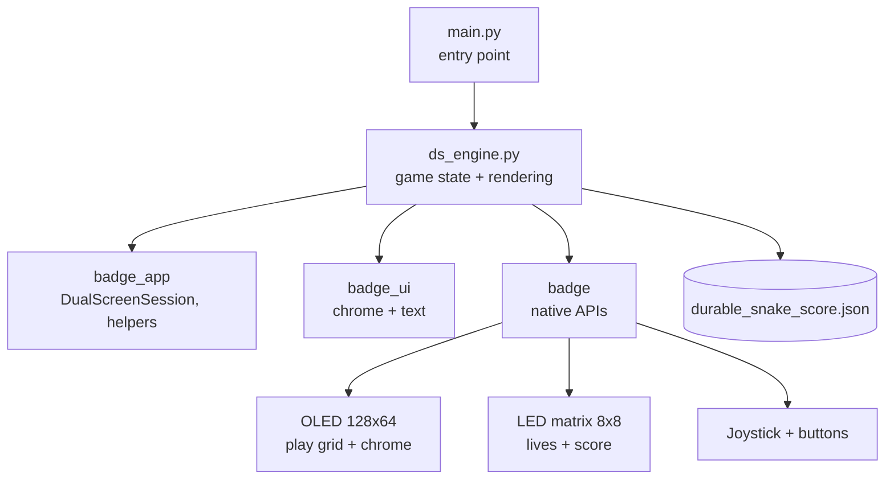

# Durable Snake

A snake game for the Temporal Replay Badge — a
MicroPython app that lets you grow long, die fast,
and continue from where you fell thanks to three
built-in retries. Inspired by Temporal's durable
execution mantra.

https://github.com/user-attachments/assets/f2cd3311-fb24-43c2-9589-72fddf574083

## Features

- **Three lives per run** — a snake bite is not the
  end. Two retries restart the snake fresh while
  keeping your score intact.
- **Geometric speedup** — the play interval shrinks
  by ~7.7% per apple eaten, from 170 ms down to a
  38 ms floor. Reaching score 20 already feels
  brutal.
- **Dual-screen output** — the OLED runs the game
  grid; the 8×8 LED matrix renders the live score as
  decimal digits in a 3×5 pixel font, with a
  hundreds bar across the top row.
- **Tardigrade bonus** — after losing a life, a rare
  tardigrade-shaped bonus food may appear. Eat it
  within 6 seconds to win an extra life back.
- **Temporal flair** — each run is tagged with a
  workflow ID shown on the game-over screen, and the
  retry prompt nods to `continue_as_new()`.
- **Visual effects** — eat-burst rings, milestone
  flashes every 10 apples (hardware OLED invert plus
  LED strobe), animated death sequence, animated
  title and game-over screens.
- **Audio and haptics** — coil-tone beep plus a
  heartbeat haptic pulse on every apple, brighter
  chime on a tardigrade catch, descending tones on
  death, vibration burst on game over.
- **Persistent best score** — saved to flash on the
  badge, survives reboots and reflashes that keep
  the filesystem.

## Deploying

```bash
PORT=/dev/cu.usbmodem2101  # whatever mpremote devs reports
mpremote connect "$PORT" resume mkdir :apps/durable_snake
mpremote connect "$PORT" resume cp \
    apps/durable_snake/ds_engine.py :apps/durable_snake/ds_engine.py
mpremote connect "$PORT" resume cp \
    apps/durable_snake/main.py   :apps/durable_snake/main.py
```

Hard-reset the badge after deploying, then launch
**durable_snake** from the **Apps** menu.

## Controls

| Input                      | Action                    |
| -------------------------- | ------------------------- |
| Joystick (4 ways)          | Steer the snake           |
| `BTN_BACK`                 | Quit the current run      |
| `BTN_CONFIRM` / `BTN_BACK` | Confirm / cancel on menus |

A 1-pixel border surrounds the play field — touching
it ends the life. When you bite yourself or hit the
wall with lives remaining, a **Bitten!** screen
offers a retry; otherwise the run ends and your
score is recorded.

The best score is saved at
`/durable_snake_score.json` on the badge filesystem.

## Architecture



The play grid is 31 columns × 13 rows of 4×4-pixel
cells, framed by a 1-pixel border just below the
chrome header. The LED matrix's top row holds a
hundreds bar (filled rightmost-first); rows 3–7
render the score as one or two decimal digits using
a 3×5 pixel font. The current life count is shown
as `Lx` in the OLED chrome header instead.
