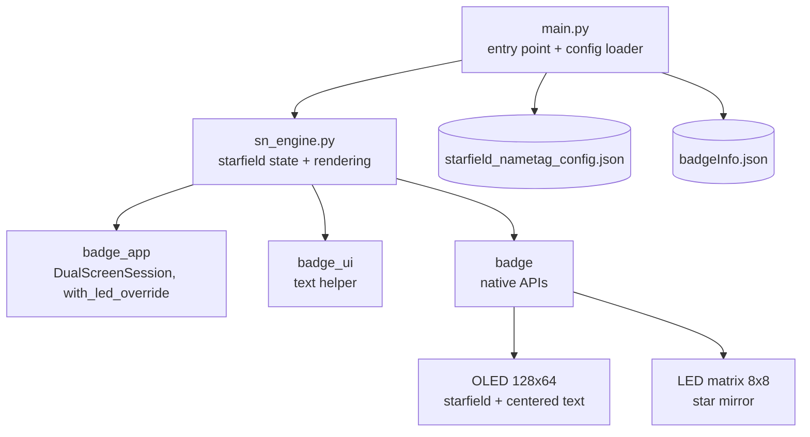

# Starfield Nametag

An animated starfield for the Temporal Replay Badge —
a MicroPython app that renders a perspective
star-flight on the OLED with a configurable nametag
text frozen at the center, mirrored on the 8×8 LED
matrix. A small piece of ambient sci-fi for the
badge, ideal for a conference nametag or event
tagline display.

https://github.com/user-attachments/assets/d5d163ab-2b34-4b27-9f75-5b28b1f62bcd

## Features

- **Perspective starfield** — stars accelerate
  outward from the center of the OLED on a
  multiplicative growth curve, switching from a
  single pixel, to a 2×1 streak, to a 2×2 block as
  they pass the camera. Recycled at the origin when
  they leave the screen.
- **Configurable centered text** — a fixed message
  sits in a punched halo at the middle of the OLED
  so it stays readable over the moving field. The
  text is resolved at launch from, in priority
  order: an explicit
  `/starfield_nametag_config.json`, the badge's
  `/badgeInfo.json` profile (rendered as
  `Hi, I'm <firstname>!`), and finally a hard-coded
  fallback in `main.py`.
- **Auto text size** — the message is auto-fitted
  to the OLED width at launch by probing the
  firmware's `oled_text_width()` from text size 4
  down to 1, picking the largest size that fits in
  120 px (128 px display minus an 8 px margin).
  Short names like *Hi, I'm Ada!* stay large; long
  full-sentence messages step down to size 1 so
  they remain visible.
- **LED matrix mirror** — eight independent stars
  drift outward across the 8×8 RGB matrix, fading
  in with distance, reinforcing the space motif
  without competing with the OLED.
- **Folder-app conventions** — installs as a
  standard `apps/starfield_nametag/` entry in the
  badge menu, exits cleanly on the back button, and
  restores the display state on cleanup.

## Deploying

```bash
PORT=/dev/cu.usbmodem2101  # whatever mpremote devs reports
mpremote connect "$PORT" resume mkdir :apps/starfield_nametag
mpremote connect "$PORT" resume cp \
    apps/starfield_nametag/sn_engine.py :apps/starfield_nametag/sn_engine.py
mpremote connect "$PORT" resume cp \
    apps/starfield_nametag/main.py   :apps/starfield_nametag/main.py
```

Hard-reset the badge after deploying, then launch
**starfield_nametag** from the **Apps** menu.

## Configuring the nametag text

The displayed text is resolved at launch in this
order:

1. **`/starfield_nametag_config.json`** — if the
   file exists and contains a non-empty `text`
   field, that string is used as-is. Use this when
   you want a custom slogan or event tagline:

   ```json
   { "text": "Replay 2026" }
   ```

2. **`/badgeInfo.json`** — the badge's profile
   file shipped on Temporal-issued badges
   (described at
   [badge.temporal.io](https://badge.temporal.io)).
   If the config file is absent, the first
   whitespace-separated token of the `name` field
   becomes the nametag, rendered as
   `Hi, I'm <firstname>!`. So a badge with
   `"name": "Alexandre Roman"` shows
   `Hi, I'm Alexandre!`.

3. **Hard-coded fallback** — the `TEXT` constant
   in `main.py` (currently `"Hello, World!"`) is
   used when neither file is available.

The text size is auto-fitted to the OLED so any
length stays on screen: the engine probes
firmware text sizes 4 → 1 and picks the largest
that fits within 120 px of the 128 px display.
Short names get bold size-4 glyphs; long
sentences fall back to size 1. There is no fixed
character limit — but messages shorter than
~10–12 characters look the most striking.

## Controls

The app is non-interactive — once launched, the
starfield runs until you exit.

| Input      | Action                     |
| ---------- | -------------------------- |
| `BTN_BACK` | Quit back to the apps menu |

## Architecture



The OLED renders 36 stars on a polar coordinate
system anchored at `(64, 32)`. Each frame multiplies
each star's radius by `1.06`, projects it back to
Cartesian, draws a shape sized by distance, and
recycles stars that leave the screen. The text
glyphs are drawn last, after punching a black halo
in the underlying buffer so the message stays
crisp. The LED matrix runs an independent eight-star
field with `1.10` growth and brightness ramped by
distance from center.
