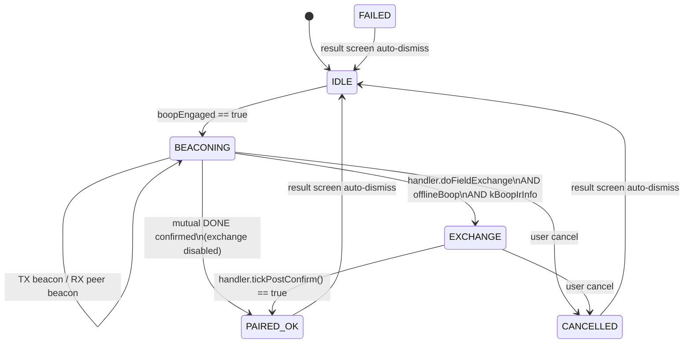

# Boop System

The **boop** is the badge-to-badge (and badge-to-installation) interaction
on IR. Two badges held face-to-face each broadcast a short signed frame on
a jittered interval while listening for the other. Once they mutually
confirm, they optionally exchange rich identity data (name, title, company,
attendee type, ticket UUID, email, website, phone, bio) over the same IR
channel and commit the result to `/boops.json` on the FAT filesystem.

The same protocol is used for non-peer installations (exhibits, queues,
kiosks) via a `BoopType` discriminator in the first beacon byte — only
peer boops run the full field exchange.

## Source map

| Concern                            | File                                                                              |
|------------------------------------|-----------------------------------------------------------------------------------|
| IR transport (RMT HW + send/recv)  | [`src/ir/BadgeIR.h`](../src/ir/BadgeIR.h), [`src/ir/BadgeIR.cpp`](../src/ir/BadgeIR.cpp) |
| Protocol state machine             | [`src/boops/BadgeBoops.h`](../src/boops/BadgeBoops.h), [`src/boops/BoopsProtocol.cpp`](../src/boops/BoopsProtocol.cpp) |
| Per-type handlers + exchange codec | [`src/boops/BoopsHandlers.cpp`](../src/boops/BoopsHandlers.cpp), [`src/boops/Internal.h`](../src/boops/Internal.h) |
| RMT NEC multi-word encoder/decoder | [`src/hw/ir/nec_tx.{c,h}`](../src/hw/ir/) / [`src/hw/ir/nec_rx.{c,h}`](../src/hw/ir/) |
| Local identity (what we TX)        | [`src/identity/BadgeInfo.h`](../src/identity/BadgeInfo.h), [`src/identity/BadgeInfo.cpp`](../src/identity/BadgeInfo.cpp) |
| Journal persistence (`/boops.json`) | [`src/boops/BoopsJournal.cpp`](../src/boops/BoopsJournal.cpp) |
| Haptic / LED feedback dispatch     | [`src/boops/BoopsFeedback.cpp`](../src/boops/BoopsFeedback.cpp) |
| Optional network helpers           | [`src/api/WiFiService.cpp`](../src/api/WiFiService.cpp), [`src/messaging/PingApiWorker.cpp`](../src/messaging/PingApiWorker.cpp) |
| Boop UI                            | [`src/screens/BoopScreen.{h,cpp}`](../src/screens/) |
| Config toggles                     | [`src/infra/BadgeConfig.cpp`](../src/infra/BadgeConfig.cpp) — `kBoopIrInfo`, `kBoopInfoFields`, `kIrTxPowerPct` |

## Architecture at a glance

The module boundary is now: **BadgeIR is pure transport** (RMT hardware +
blocking `sendFrame`/`recvFrame` + MicroPython queue). **BadgeBoops owns
all protocol logic** — phase state machine, beacon/field codecs, journal
persistence, per-type handlers, and feedback dispatch.

```mermaid
flowchart LR
    subgraph Core1[Core 1]
        GUI[BoopScreen / BoopResultScreen]
    end
    subgraph Core0[Core 0 irTask]
        Transport[BadgeIR<br/>sendFrame / recvFrame<br/>RMT HW lifecycle]
        State[BadgeBoops state machine<br/>beacon / confirm / exchange]
        Handlers[Per-type handlers<br/>peer / exhibit / queue / kiosk / checkin]
    end
    subgraph FAT[FAT filesystem]
        BoopsJson[/boops.json]
        InfoTxt[/badgeInfo.txt]
    end

    GUI -->|irHardwareEnabled boopEngaged| State
    State --> Transport
    Transport --> State
    State --> Handlers
    Handlers -->|recordBoopEx| BoopsJson
    InfoTxt -->|getCurrent| State
    Handlers -->|BoopFeedback::*| Haptics
```

- GUI work lives on Core 1; IR hardware, protocol state machine, and journal
  writes live on Core 0 (`irTask`).
- `irHardwareEnabled` and `boopEngaged` are `volatile bool` single-byte
  atomic flags (no mutex).
- `BadgeBoops::recordBoopEx` is called from Core 0; `readJson` from Core 1.
  Protected by a `SemaphoreHandle_t` mutex (not portMUX — we do FAT I/O
  under the lock, portMUX would trip the interrupt watchdog).
- Boops are recorded locally in `/boops.json`. The public offline firmware does
  not require a background pairing API to complete a badge-to-badge boop.

## IR frame formats

All frames are NEC multi-word (RMT driver). `word0` low byte is the
frame type. Self-echoes are filtered in [`isSelfEcho()`](../src/ir/BadgeIR.cpp).

### Beacon word0 layout (new v1 protocol)

```
 byte3   byte2   byte1       byte0
+-------+-------+-----------+------+
| flags | ver=1 | BoopType  | 0xB0 |
+-------+-------+-----------+------+
```

Old badges that predate the `BoopType` byte send `byte1 == 0x00` which
equals `BOOP_PEER`, so old↔new interop works for peer boops without
requiring both sides to be reflashed simultaneously.

### Frame types (protocol v2, `kBoopProtocolVer = 0x02`)

Beacon phase (back-compat with v1 wire format):

| Type  | Name             | Words | Layout (words beyond word0)            | Purpose                                                |
|-------|------------------|-------|----------------------------------------|--------------------------------------------------------|
| 0xB0  | `IR_BOOP_BEACON` | 3     | UID lo/hi bytes in words[1..2]         | "I'm here, UID X". Sent on jittered interval.          |
| 0xB1  | `IR_BOOP_DONE`   | 3     | UID lo/hi bytes in words[1..2]         | "I've recorded the boop." Sent after threshold met.    |

Exchange phase (manifest-driven streaming, all new in v2):

| Type  | Name                 | Words    | Purpose                                                    |
|-------|----------------------|----------|------------------------------------------------------------|
| 0xC0  | `IR_BOOP_MANIFEST`   | 3        | "I have these tags, bio is K chunks."                      |
| 0xC1  | `IR_BOOP_STREAM_REQ` | 3        | "Send me everything in your manifest now."                 |
| 0xC2  | `IR_BOOP_DATA`       | 3..~55   | 1+ batched `(tag, chunkIdx, len, bytes)` TLVs + hasMore.   |
| 0xC3  | `IR_BOOP_NEED`       | 3        | "I'm missing tag N chunk M, resend it."                    |
| 0xC4  | `IR_BOOP_FIN`        | 3        | "I'm done pulling."                                        |
| 0xC5  | `IR_BOOP_FINACK`     | 3        | "I saw your FIN, I'm done too."                            |

All frames carry `words[1..2] = sender UID` for the self-echo filter in
[`BadgeIR::isSelfEcho`](../src/ir/BadgeIR.cpp).

### Field tags

| Tag | Name             | Source                          |
|-----|------------------|---------------------------------|
| 0   | `FIELD_NAME`           | `BadgeInfo::Fields.name`       |
| 1   | `FIELD_TITLE`          | `BadgeInfo::Fields.title`      |
| 2   | `FIELD_COMPANY`        | `BadgeInfo::Fields.company`    |
| 3   | `FIELD_ATTENDEE_TYPE`  | `BadgeInfo::Fields.attendeeType` (RX-only) |
| 4   | `FIELD_TICKET_UUID`    | `BadgeInfo::Fields.ticketUuid` |
| 5   | `FIELD_EMAIL`          | `BadgeInfo::Fields.email`      |
| 6   | `FIELD_WEBSITE`        | `BadgeInfo::Fields.website`    |
| 7   | `FIELD_PHONE`          | `BadgeInfo::Fields.phone`      |
| 8   | `FIELD_BIO`            | `BadgeInfo::Fields.bio` (up to 4 × 32 B chunks) |

Tags 5–8 are gated by the `kBoopInfoFields` bitmask so users can opt out
of broadcasting any optional field (bits 0–4 ignored for TX policy —
core fields always sent if non-empty).  `FIELD_ATTENDEE_TYPE` is masked
off unconditionally on TX and is not rendered by any screen — the wire
slot is kept for back-compat with already-flashed senders.

**Empty tags never hit the wire.** The v2 manifest explicitly declares
which tags a sender will transmit; the peer only requests what the
manifest advertises.  No placeholder / empty-payload frames are ever
emitted.

## Handler dispatch

Each `BoopType` owns a function-pointer ops table. The state machine
calls into it at beacon-lock and during post-confirm, and `BoopScreen`
calls it for the handler-specific left-info drawing. Adding a new
installation type is one new table entry plus four small functions.

```cpp
struct BadgeBoops::BoopHandlerOps {
  const char* name;
  void  (*onLock)(BoopStatus& s);
  bool  (*tickPostConfirm)(BoopStatus& s, uint32_t nowMs);
  void  (*drawContent)(oled& d, const BoopStatus& s, int x, int y, int w, int h);
  const char* (*statusLabel)(const BoopStatus& s);
  bool  doFieldExchange;
};

const BoopHandlerOps* BadgeBoops::handlerFor(BoopType t);
```

```cpp
enum BoopType : uint8_t {
  BOOP_PEER        = 0x00,  // two badges
  BOOP_EXHIBIT     = 0x01,  // installation broadcasts exhibit_id
  BOOP_QUEUE_JOIN  = 0x02,  // queue kiosk; WiFi later pushes "your turn"
  BOOP_KIOSK_INFO  = 0x03,  // one-way info beacon
  BOOP_CHECKIN     = 0x04,  // session/room check-in
  // 0x05..0x07 reserved
};
```

Current handlers live in [`BoopsHandlers.cpp`](../src/boops/BoopsHandlers.cpp):

| Handler          | `doFieldExchange` | `onLock` action                            | `drawContent`                                     |
|------------------|-------------------|--------------------------------------------|---------------------------------------------------|
| `kPeerHandler`   | **true**          | No-op — API/journal work done elsewhere    | Name (large) / company / title / email           |
| `kExhibitHandler`| false             | Populate `installationId`, record exhibit  | "EXHIBIT — Visit logged!" + id                    |
| `kQueueHandler`  | false             | Populate `installationId`, record queue    | "QUEUE — Queued! we'll buzz when it's your turn." |
| `kKioskHandler`  | false             | Populate `installationId`, record kiosk    | "KIOSK — Info received." + id                     |
| `kCheckinHandler`| false             | Populate `installationId`, record check-in | "CHECK-IN — Checked in!" + id                     |

Flow:

1. `handleBeaconing` completes the mutual-confirm handshake, then calls
   `handlerFor(boopStatus.boopType)->onLock(boopStatus)`.
2. The short IR handshake supplies the peer badge UID and records the local
   boop result.
3. If `h->doFieldExchange && offlineBoop && kBoopIrInfo`, the state
   machine enters `BOOP_PHASE_EXCHANGE` and each tick delegates to
   `h->tickPostConfirm(boopStatus, now)`. The peer handler's version
   runs the v2 manifest/stream/NEED/FIN exchange; installation handlers
   return true immediately.
4. When `tickPostConfirm` returns true, the state machine writes the
   journal via `recordBoopEx()` and transitions to `BOOP_PHASE_PAIRED_OK`.

`BoopScreen::render` calls `h->drawContent(d, 0, 12, 78, 36, boopStatus)`
for the left-content region, regardless of type. Exhibits / queues /
kiosks share the same header + ziggy + marquee chrome and only paint
their own left block.

## Phase state machine

Phases are declared in [`BadgeBoops.h`](../src/boops/BadgeBoops.h) as
`BadgeBoops::BoopPhase` with values `BOOP_PHASE_{IDLE, BEACONING,
EXCHANGE, PAIRED_OK, FAILED, CANCELLED}`. Diagram shows informal names
without the prefix for readability:



### Beaconing

- Jittered TX every `BOOP_BEACON_INTERVAL_MS` + `0..BOOP_BEACON_JITTER_MS`
  (400 ms + 0..150 ms).
- When `beaconRxCount >= BOOP_BEACON_RX_THRESHOLD` and
  `beaconTxCount >= BOOP_BEACON_TX_MIN`, the firmware records the local boop
  and flips our beacons from `0xB0` to `0xB1` (DONE).
- After seeing peer's `0xB1`, we send `kBoopConfirmTxCount` more `0xB1`
  frames so the peer definitely sees ours before we stop.
- After the last confirm TX, call the handler's `onLock`, then decide:
  - `handler.doFieldExchange && offlineBoop && kBoopIrInfo` → `BOOP_PHASE_EXCHANGE`.
  - otherwise → `BOOP_PHASE_PAIRED_OK`.

If a peer `IR_BOOP_MANIFEST` arrives while we're still in BEACONING, we
stash it in `s_earlyFrame` and fast-forward our own confirm TXes so
`peer_tickPostConfirm`'s first tick can replay it as its own first RX
event.

### Exchange (manifest-driven streaming)

Entry requires the mutual-confirm handshake to have completed first —
this synchronizes both badges on the phase transition.

Both sides run the same `peer_tickPostConfirm` function, which walks a
simple phase machine:

1. **`MANIFEST_XCHG`** — each side TXes its own `MANIFEST` (tagMask +
   bio chunk count).  The manifest is the single point of truth for
   "what I have"; empty and gated-off tags are omitted so the peer
   never requests them.
2. **`PRIMARY_PULL`** — lower-UID (primary) sends `STREAM_REQ`;
   secondary serves with a burst of batched `DATA` frames (one frame
   carries multiple `(tag, chunkIdx, len, bytes)` TLVs; bio chunks
   follow as their own small frames).  The final frame sets
   `hasMore = 0`.
3. **`PRIMARY_REPAIR`** — if primary didn't receive every tag/chunk it
   expected, it emits targeted `NEED` frames until gaps fill.
4. **`SECONDARY_PULL`** — primary sends `FIN`; on that signal secondary
   starts its own `STREAM_REQ` and primary streams its DATA back.
5. **`SECONDARY_REPAIR`** — mirror of step 3.
6. **`FIN_XCHG`** — secondary sends `FIN` when done pulling; both sides
   trade `FINACK` to confirm closure.  When everyone has seen
   everyone's `FIN` and their own `FIN` has been acked, both
   transition to `DONE` and the state machine calls `finishPaired()`.

Retransmit: every "meta" frame (MANIFEST / STREAM_REQ / NEED / FIN /
FINACK) is cached in `s_xchg.lastMetaWords`.  If the phase hasn't
advanced in `kRetxMs` (2800 ms, chosen to comfortably exceed the
longest legitimate DATA frame on the wire so the primary never
retransmits STREAM_REQ / NEED while the secondary is still mid-burst),
we replay the cached frame.  `DATA` frames are not cached individually —
lost data is repaired via targeted `NEED` requests.

Sizing contract: `serveStreamReq` caps its per-frame payload at
`kMaxTlvBytes = 120 B` (well below the 240 B NEC hardware ceiling).  A
full realistic identity (name + title + company + email + website +
1 bio chunk ≈ 115 B) fits in a single DATA frame, which the receiver
decodes reliably.  Multi-frame DATA bursts (two TXes ~10 ms apart) are
unreliable on this hardware — likely an interaction between the
secondary's back-to-back TX and the receiver's `rmt_receive` re-arm
window — so staying single-frame is the pragmatic correctness bet.  A
120 B frame is ~34 words ≈ 1.85 s on the wire with typical ASCII bit
density, inside `kRetxMs` with ~950 ms margin.  The multi-frame race
itself is a known open bug; see the open-work section below.

### No background invite listener

Prior firmware kept the RMT hardware up outside of an active boop and
surfaced incoming `BEACON` frames as an "invite toast" (UP-to-accept).
That path was removed because it could auto-engage a boop before the
handler table's `doFieldExchange` path was fully set up, leaving the
UID handshake done but no field exchange occurring.  The boop screen
now always requires an explicit UP press to start.

Background notification RX over IR has since been removed; user-visible
messages and zigmojis now arrive through WiFi pings. `BadgeIR` is active for
the Boop screen and MicroPython IR mode rather than an always-on invite or
notification listener.

### No-timeout contract

The exchange phase has **no hard timeouts**.  Exit paths are exactly:

1. `s_xchg.phase == XCHG_DONE` (all FINs ack'd both ways) — normal
   completion, `finishPaired` records the rich partner info.
2. User presses Left → `pairingCancelRequested` → `handleCancel`.
3. User pops the BoopScreen → `BoopScreen::onExit` clears
   `irHardwareEnabled` → `smShutdown` aborts on the next tick.

There is no `kExchangeSafetyMs` / `kNoRxExitMs` bailout.  Retransmit
runs forever, bounded by user attention span.

### Lower vs higher UID

In the new protocol, the UID comparison determines which side is
"primary" (pulls first).  Lower UID = primary; higher UID = secondary.
After manifests are traded, phase transitions are driven by the `FIN`
frames each side emits when its pull completes.

## Timing constants

| Constant                    | Value  | Where                                                 |
|-----------------------------|--------|-------------------------------------------------------|
| `BOOP_BEACON_INTERVAL_MS`   | 400    | [`BadgeIR.h`](../src/ir/BadgeIR.h)                    |
| `BOOP_BEACON_JITTER_MS`     | 150    | "                                                     |
| `BOOP_BEACON_RX_THRESHOLD`  | 1      | "                                                     |
| `BOOP_BEACON_TX_MIN`        | 1      | "                                                     |
| `kBoopConfirmTxCount`       | 1      | "                                                     |
| `kBoopBioChunkBytes`        | 32     | "                                                     |
| `kBoopBioMaxChunks`         | 4      | "                                                     |
| `kRetxMs`                   | 2800   | [`BoopsProtocol.cpp`](../src/boops/BoopsProtocol.cpp) |
| `kMaxTlvBytes` (`serveStreamReq`) | 120 | [`BoopsHandlers.cpp`](../src/boops/BoopsHandlers.cpp) — DATA split threshold |

## RMT hardware tuning

The ESP32-S3 RMT peripheral is configured for streaming efficiency in
[`nec_tx.c`](../src/hw/ir/nec_tx.c) / [`nec_rx.c`](../src/hw/ir/nec_rx.c):

- **TX:** `mem_block_symbols = 256` (DMA buffer size) so the ISR
  encoder can stage a full streaming DATA frame (~55 data words) in one
  shot without ping-pong latency.  `trans_queue_depth = 4` lets the
  state machine queue DATA[N+1] while DATA[N] is still draining the
  DMA buffer — this is what enables true back-to-back streaming via
  the new `nec_tx_send_nowait` path.
- **RX:** `mem_block_symbols = NEC_RX_SYMBOL_COUNT (2112)` — fits a
  worst-case 64-word NEC frame with margin.  `en_partial_rx` remains
  off because v2 frames never overflow the buffer.
- **DMA** is on for both channels (already baseline).
- **Carrier:** 38 kHz, 50 % duty by default — unchanged.

## What gets transferred

Only 8 of the 9 field tags above are transmitted: `FIELD_ATTENDEE_TYPE` is
unconditionally masked off on TX. No binary blobs, no nametag bitmap, no boop
count, no timestamps, and no notes are transferred over IR. Everything else in
`/boops.json` is local-only.

## What gets stored

### `BoopStatus` (volatile, RAM only — [`BadgeBoops.h`](../src/boops/BadgeBoops.h))

Holds the current boop's in-flight state: `phase`, `boopType`,
`peerUID` + `peerUidBytes[6]`, nine `peer*` strings, `installationId[9]`,
`fieldTxMask`/`fieldRxMask` (`uint16_t`), `currentFieldTag`,
`lastFieldDirection`, `lastFieldEventMs`, `beaconTxCount`,
`beaconRxCount`, `pairingId`, `offlineBoop`, and status/phase timers.
This struct is what the UI reads live during a boop.

### `/boops.json` (FAT — [`BoopsJournal.cpp`](../src/boops/BoopsJournal.cpp))

Mirrors the server's `BoopListResponse` shape so the file can be
round-tripped without transformation. Up to `kMaxBoopRecords = 30`
records. Only the most recent visit is tracked per pair — repeat boops
overwrite `last_seen` and bump `boop_count`. `kDocCapacity = 16 * 1024`
in-memory JSON budget keeps the full journal well under the 32 KB
serialized ceiling enforced on load.

Legacy records written by earlier firmware that kept a `connected_at`
visit-history array are migrated on load: the tail timestamp is pulled
into `last_seen` and the array is removed, after which the journal is
rewritten to shrink on disk.

Local boops land here with `status: "local"` and `pairing_id: 0`. Do not call
`recordBoop` a second time for the same physical boop or the count will double.

```jsonc
{
  "pairings": [
    {
      // Identity
      "badge_uuids":   ["<lo>", "<hi>"],          // sorted, 12-char hex
      "ticket_uuids":  ["<myTicket>", "<peerTicket>"],  // slot order matches badge_uuids
      "boop_type":     0,                          // BoopType enum (0=peer)

      // History — most recent visit only
      "first_seen":    "2026-04-20T12:34:56Z",
      "last_seen":     "2026-04-21T09:15:02Z",
      "boop_count":    3,

      // Server state (when online)
      "status":        "local" | "pending" | "confirmed",
      "workflow_id":   "badge-pairing-...",        // pending only
      "pairing_id":    0,

      // Peer identity (from IR exchange or server partner payload)
      "partner_name":           "...",
      "partner_title":          "...",
      "partner_company":        "...",
      "partner_attendee_type":  "...",
      "partner_email":          "...",
      "partner_website":        "...",
      "partner_phone":          "...",
      "partner_bio":            "...",

      // Local-only
      "user_notes":    ""

      // Only set for non-peer boops:
      // "installation_id":   "EXH_0042",
      // "installation_kind": "exhibit" | "queue" | "kiosk" | "checkin"
    }
  ]
}
```

- Tiebreaker for record identity is the sorted `badge_uuids` pair.
- `partner_*` fields from an authoritative `BoopResult` (online API) always
  override earlier values. Values from the IR field exchange only fill
  in empty slots (non-destructive).
- `user_notes` is never populated from the network — edited locally via
  the Contacts menu and TextInputScreen.

### `/badgeInfo.txt` (FAT — [`BadgeInfo.cpp`](../src/identity/BadgeInfo.cpp))

Our own identity that gets transmitted during `BOOP_PHASE_EXCHANGE`. INI format:

```ini
[identity]
ticket_uuid   = ...
name          = ...
title         = ...
company       = ...
attendee_type = ...

[personal]
email   = ...
website = ...
phone   = ...
bio     = ...
```

Boot reconcile (in [`main.cpp`](../src/main.cpp)):

1. Try `BadgeInfo::loadFromFile()`.
2. If missing, fall back to NVS (`BadgeStorage::loadBadgeInfo` +
   `loadMyTicketUUID`).
3. If NVS is also empty, seed random defaults from word lists
   (`BadgeInfo::populateDefaults`, uses `esp_random`).
4. Write the result back to `/badgeInfo.txt` and apply to globals.

Server pairing path (`BadgePairing.cpp`): when `fetchBadgeXBM` returns
an attendee record, `mergeFromServer` overwrites only **blank** core
fields. User-typed optional fields are never clobbered by the server.

## What gets displayed

The current screen lives in [`src/screens/BoopScreen.cpp`](../src/screens/BoopScreen.cpp)
and is registered from [`src/ui/GUI.cpp`](../src/ui/GUI.cpp).

### BoopScreen layout (128x64)

One screen serves every `BoopType`. The ziggy + TX-chip band + marquee
are universal; the left-info block is painted by the current handler's
`drawContent` so exhibits, queues, kiosks, etc. can put whatever they
want there without touching the screen code.

```
 col:   0                           77 80              127
row  0: +-- TX chip ascending band -+                    
row  0: |    "name^"  "co^"  ...    |  ziggy_*_48        
row 11: +---------------------------+  (48x48 at 80,0,    
row 12: | PEER NAME (LARGE)         |   state-driven:    
row 22: | Company (SMALL)           |   idle  = blink    
row 30: | Title   (SMALL)           |   beacon= fly      
row 38: | email   (TINY)            |   xchg  = wow      
row 46: +---------------------------+   ok    = heart    
row 47: ==== divider HLine =============  fail  = sleep   
row 48: |                                               |
row 48: | marquee (FONT_TINY, scrolls left ~24 px/s)    |
row 48: | "LOCK 4f3c . TX name . RX co . DONE . ..."    |
row 63: +-----------------------------------------------+
```

- **Top TX-chip band** (rows 0–10): ephemeral labels that fade upward
  off the top of the screen — where the IR LED physically sits — each
  time a FIELD is successfully TX'd. Pushed from
  `BoopScreen::poll()` edge-detecting `boopStatus.fieldTxMask` bits.
- **Ziggy 48×48** (cols 80–127, rows 0–47): state-driven sprite picks
  `ziggy_blink_48 / fly_48 / wow_48 / heart_48 / sleep_48` based on
  `boopStatus.phase`. Frame rate scales with urgency (130 ms beacon,
  250 ms paired).
- **Left-info block** (cols 0–77, rows 12–46): `handlerFor(boopType)
  ->drawContent(d, 0, 12, 78, 36, boopStatus)`. Peer handler renders
  name / company / title / email.  `FIELD_ATTENDEE_TYPE` is
  intentionally never shown.
- **Bottom marquee** (rows 48–63): 16 px scrolling strip, `FONT_TINY`.
  Consumes chips pushed by `BoopFeedback::pushMarqueeEvent()`
  (`"LOCK xxxx"`, `"TX name"`, `"RX co"`, `"API ok"`, `"DONE"`).
  When the buffer is short or empty, falls back to a live
  phase / status text + nav hint (`UP:start <:back` etc.).

### Peer Pickers and Dependent Apps

There is no standalone contacts-detail screen in the current firmware. Screens
that need contacts call `BadgeBoops::listActivePeers()` over `/boops.json`.
`PeerPickerScreen` uses that list for message composition, and games such as
1D Chess refresh peer tickets from the same journal before sending pings.

## Config toggles

All in the `[boop]` section of `/settings.txt`:

| Key             | Range      | Default | Effect                                                        |
|-----------------|------------|---------|---------------------------------------------------------------|
| `boop_ir_info`  | 0 / 1      | 1       | Enable identity field exchange on offline boops.              |
| `boop_fields`   | 0 – 0x1FF  | 0x1FF   | Bitmask of field tags to TX. Bits 0–4 effectively always on (core fields); bits 5–8 gate email/website/phone/bio. |
| `ir_tx_pw`      | 1 – 50     | 50      | TX power (= carrier duty). Calls `irSetTxPower()`.            |

## Feedback hooks (`BoopFeedback::*`)

Simple dispatcher in [`BoopsFeedback.cpp`](../src/boops/BoopsFeedback.cpp).
Called from
`irTask` (and the handler-table `onLock` calls) at key protocol events:

- `onBeaconLock(type, installationId)` — mutual confirm complete, handler dispatch about to fire.
- `onPeerFieldTx(tag)` — we just sent a FIELD.
- `onPeerFieldRx(tag)` — we just received a FIELD.
- `onComplete(type, success)` — boop fully done.
- `onInstallation(type, installationId)` — installation-type lock.
- `pushMarqueeEvent(chip)` / `popMarqueeEvent(out, cap)` — bottom-band
  event ring, spinlock-protected so either core can post.

Each haptic event maps to a `Haptics::pulse(ms, now)` of appropriate
duration. Each user-visible event also posts a marquee chip that the
BoopScreen ticker scrolls across the bottom band.

## Open / future work

- **Multi-frame DATA reliability.**  A `serveStreamReq` burst that
  splits into two back-to-back DATA frames (one badge TXes frame 1, 10 ms
  later frame 2) is currently not reliably decoded by the peer.  The
  current mitigation is `kMaxTlvBytes = 120` which keeps a typical full
  identity manifest (~115 B) single-frame; any config larger than that
  falls back into the broken path.  Suspected root cause is a race
  between the second TX and `nec_rx`'s `rmt_receive` re-arm gap.
  Candidate fixes: bump `s_frame_queue` depth above 4 so self-echoes
  can't evict peer frames during the sender's own TX block; add a
  deliberate `vTaskDelay(~20 ms)` between DATA frames in `serveStreamReq`
  so the receiver's re-arm always completes before the next frame
  lands; or introduce a one-shot `IR_BOOP_STREAM_ACK` from the
  secondary immediately on STREAM_REQ receipt so the primary arms
  `peerStreamStarted` via a short 3-word frame instead of waiting on
  the first DATA header.
- Remove or repurpose `boop_info_tx` — dead config value under the async
- Flesh out installation handlers with real flows: server-side queue
  notification delivery pushes to the badge, which then fires a local
  haptic — need to define that WiFi protocol. Exhibit handler should
  fetch rich content from a future `/api/v1/exhibit/{id}` endpoint.
- Contacts filter by `boop_type`.
- LED ring animation during `BOOP_PHASE_EXCHANGE` (wire `badgeMatrix`
  into `BoopFeedback::onPeerField{Tx,Rx}`).
