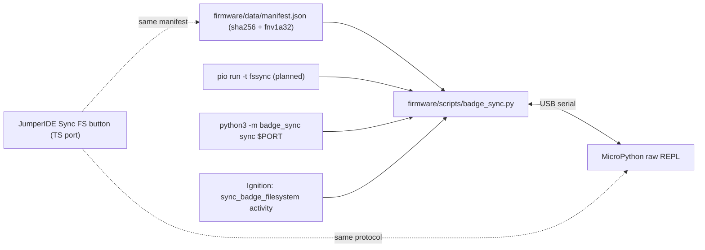

# Temporal Replay 2026 Badge — Storage Model

This is the **mental model** for where data lives on the badge and what
survives each kind of flash. Read this before:

- writing a Python app that needs to save anything (game state, scores)
- modifying the OTA / Community Apps / sync code paths
- running `pio run -t uploadfs`, Ignition, a factory-image flash,
  or the JumperIDE "Sync Filesystem" button

> **Audience**: badge developers. End users don't need to know any of
> this — the firmware handles it transparently.

---

## TL;DR

Three storage tiers; one rule for picking which to use:

| Tier | Holds | Survives |
|------|-------|----------|
| **NVS** (`badge_*` namespaces) | badge UID, HMAC, WiFi creds, contacts, badgeInfo, `badge.kv` (game saves, scores), asset version stamps, menu order | **EVERY** flash type |
| **FATFS** (`/lib`, `/apps`, `/docs`, `/images`, …) | Python source code, docs, images, `doom1.wad`, user uploads | Firmware-only flash. **Wiped** by `fatfs.bin` reflash + uploadfs + a `clear-extras` sync |
| **app0** (firmware binary) | C++ binary + embedded `/lib` + `/matrixApps` survival floor | Replaced only by a firmware flash |

Rule of thumb:

- **Code** → goes on FATFS, ships via `firmware/data/`. Survival floor for
  the absolute essentials (`/lib`, `/matrixApps`) is baked into app0.
- **State** → goes in NVS via `badge.kv` so it survives reflashes.

---

## Source-of-truth vs build-mirror

```
firmware/initial_filesystem/   ← canonical, hand-edited, in git
firmware/data/                 ← byte-identical mirror (gitignored,
                                 generated by scripts/generate_startup_files.py).
                                 PlatformIO's `pio run -t buildfs/uploadfs`
                                 reads from here.
```

Edit files in `initial_filesystem/`, run the generator (or build —
it's a `pre:` script), and `data/` is rebuilt automatically.
**Never edit `data/` directly**; your changes will be overwritten.

## What gets baked into app0?

Only files under `firmware/initial_filesystem/lib/` and
`firmware/initial_filesystem/matrixApps/` are embedded into the
firmware binary. The list is fixed via `BAKE_DIRS = {'lib', 'matrixApps'}`
at the top of `scripts/generate_startup_files.py`.

These five files are the **survival floor**: with nothing else on
FATFS, the badge can still boot to its menu, run a Python REPL via
JumperIDE, and sync the rest of the filesystem from there.

```
initial_filesystem/lib/badge_app.py        ← bake
initial_filesystem/lib/badge_kv.py         ← bake
initial_filesystem/lib/badge_ui.py         ← bake
initial_filesystem/matrixApps/LED.py       ← bake
initial_filesystem/matrixApps/led_runtime.py ← bake
initial_filesystem/apps/**                 ← NOT baked, ships via fatfs.bin
initial_filesystem/docs/**                 ← NOT baked, ships via fatfs.bin
initial_filesystem/images/**               ← NOT baked, ships via fatfs.bin
initial_filesystem/doom1.wad               ← NOT baked, ships via fatfs.bin
                                              (and downloadable via Community Apps
                                              for badges that didn't get an
                                              uploadfs pass)
```

doom1.wad is intentionally excluded from `manifest.json` (it's a 4 MB
binary; pushing it over the raw REPL takes several minutes) but it
IS included in `firmware/data/` and therefore in `fatfs.bin`. The
canonical way to install it is `pio run -t uploadfs`; badge_sync's
diff will report it as "extras" on the badge (which is fine — extras
are preserved by default).

The boot-time `provisionStartupFiles()` walks the bake set and
restores any that are missing or hash-mismatched (with user-edit
detection so your modified copy stays intact). It does **not** create
files that aren't in the bake set — those come from `fatfs.bin`,
Community Apps, or `badge_sync`.

---

## What writes each tier?

```
                       ┌──────────┐  ┌──────────┐  ┌──────────┐
                       │   NVS    │  │  FATFS   │  │   app0   │
                       └──────────┘  └──────────┘  └──────────┘
Firmware reflash             ✓             —             ✗
  (./start.sh, OTA)
fatfs.bin reflash            ✓             ✗             ✓
  (factory image,
   pio uploadfs)
Full esptool batch           ✓             ✗             ✗
  (factory flash)
OTA firmware update          ✓             ✓             ✗
Community Apps install       ✓        partial (1 file)   ✓
JumperIDE Save               ✓        partial (1 file)   ✓
badge_sync sync              ✓        partial (diff)     ✓
badge_sync sync
  --clear-extras             ✓     ✗ (extras wiped)      ✓
```

Legend: ✓ = preserved, ✗ = wiped/replaced, — = irrelevant.

The takeaway: **NVS is invariant**. As long as you put state behind
`badge.kv`, the user never loses their game progress / contacts /
identity, regardless of which flash path the badge goes through.

---

## Where to put state in your app

### `badge.kv` (recommended)

```python
import badge

score = badge.kv_get("hi_breaksnake", 0)
score += 1
badge.kv_put("hi_breaksnake", score)
```

Or via the friendlier wrapper that ships in `/lib/badge_kv.py`:

```python
from badge_kv import kv

kv.put("hi_breaksnake", kv.get("hi_breaksnake", 0) + 1)
```

Limits:

- 15 chars per key (NVS hard limit; ASCII printable, no `"` or backslash)
- 1 KB per value
- 64 keys per badge
- Supported value types: `str`, `int`, `float`, `bytes`

### `open()` on FATFS

Still works for **transient or replaceable** content (caches,
downloaded data that can be re-fetched, large blobs over 1 KB). Don't
use for state you'd be sad to lose:

```python
# Fine — it's a cache that can be rebuilt.
with open("/cache/last_query.json", "w") as f:
    f.write(json.dumps(result))
```

```python
# WRONG — wiped by every fatfs.bin reflash.
with open("/save.json", "w") as f:
    f.write(json.dumps(score_state))
```

---

## Common workflows

### "I just need the FATFS partition repopulated"

```bash
cd firmware
~/.platformio/penv/bin/pio run -e <env> -t uploadfs
```

Writes the full `firmware/data/` tree (apps + docs + images +
**doom1.wad** + everything) into a fresh `fatfs.bin` and flashes it.
Fastest path. Doesn't touch NVS — saves, contacts, badge identity all
preserved.

> **Always use `~/.platformio/penv/bin/pio` directly.** The system
> `pio` shim resolves through pyenv / micromamba and frequently
> lands on a Python without `platformio` installed, giving you
> `ModuleNotFoundError: No module named 'platformio'`. The wrapped
> binary is unaffected because it ships its own venv. The
> `firmware/build.sh` and `ignition/start.sh` scripts already use
> the wrapped path; problems only show up if you call `pio` by hand.

### "I just changed two app files, don't reflash everything"

```bash
cd firmware
python3 scripts/badge_sync.py sync /dev/cu.usbmodemXXXX
```

Diffs the badge against `initial_filesystem/manifest.json`, pushes
only what changed. Disconnect any active serial monitor first
(`pkill -f "device monitor"`).

### "I want to flash factory firmware AND fatfs in one go"

```bash
cd ignition
./start.sh --no-build --factory-image ~/Downloads/replay2026-factory-16MB.bin
```

Writes bootloader, partition table, firmware, and FATFS in a single factory
image through Ignition's normal device detection, batching, and verification
flow. Factory flashing wipes existing on-badge files; use
`scripts/badge_sync.py` afterwards only when you intentionally want to restore
the source tree's filesystem contents over USB serial.

### "Conference floor, sync over WiFi"

Open **Community Apps** on the badge (home grid) and pick what you
want. Pulls from `registry/community_apps.json`. Useful for users
who can't run PlatformIO themselves.

---

## The diff-sync engine

`firmware/scripts/badge_sync.py` is the **single** implementation that raw
shells and Ignition reuse; JumperIDE uses the same raw-REPL style protocol.
It speaks the MicroPython raw REPL (Ctrl-A) and:

1. Lists every file on `/` with size + FNV-1a hash via a small
   walker script (extension of `viperide_reinit.py`).
2. Diffs against `firmware/data/manifest.json` (generated alongside
   `StartupFilesData.h`).
3. Diffs against `firmware/initial_filesystem/manifest.json`
   (generated alongside `StartupFilesData.h`).
4. Pushes missing/stale files via base64-chunked raw REPL.
5. Optionally clears extras (off by default — preserves user uploads).



Common workflows:

```bash
# 1. List everything currently on the badge.
python3 firmware/scripts/badge_sync.py list /dev/cu.usbmodemXXXX

# 2. Show what would change (dry run).
python3 firmware/scripts/badge_sync.py diff -v /dev/cu.usbmodemXXXX

# 3. Push missing + stale files; preserve user uploads.
python3 firmware/scripts/badge_sync.py sync /dev/cu.usbmodemXXXX

# 4. Aggressive: also delete files on the badge that aren't in the
#    manifest. Use with care; this wipes user uploads.
python3 firmware/scripts/badge_sync.py sync --clear-extras /dev/cu.usbmodemXXXX

# 5. Push a single file.
python3 firmware/scripts/badge_sync.py push /dev/cu.usbmodemXXXX /apps/foo.py
```

---

## NVS namespace map

| Namespace | Owner | Contents |
|-----------|-------|----------|
| `badge_identity` | `BadgeUID`, `BadgePairing` | UUID, HMAC secret, enrollment state |
| `badge_contacts` | `BoopsJournal` | serialized BoopRecord array |
| `badge_qr` | `BadgeQR` | cached QR code bytes |
| `badge_info` | `BadgeInfo` | name/title/company/contact JSON blob |
| `badge_kv` | Python `badge.kv_*` | user game saves / scores / prefs |
| `badge_assets` | `AssetRegistry` (Community Apps) | per-asset installed version stamp, last-refresh epoch |
| `badge_config` | `BadgeConfig` | settings.txt mirror, saved WiFi credential slots |
| `badge_menu` | `AppRegistry` | persisted menu order |

Adding a new namespace? Pick one with the `badge_` prefix and document
it here. Each namespace gets its own iterator scope, so collisions
between modules are impossible by construction.

---

## Schema versions

| Schema | File | Producer | Consumer |
|--------|------|----------|----------|
| v1 | `registry/registry.json` | hand-edited | older firmware out in the field |
| v2 | `registry/community_apps.json` | `generate_startup_files.py` | current firmware (Community Apps) |
| – | `firmware/data/manifest.json` | `generate_startup_files.py` | `badge_sync.py`, JumperIDE |
| – | `firmware/data/apps/<app>/manifest.json` | `generate_startup_files.py` | future multi-file install path |

The v1 registry is left in place so older badges that haven't been
firmware-updated still see their original asset list. New entries go
into v2.
