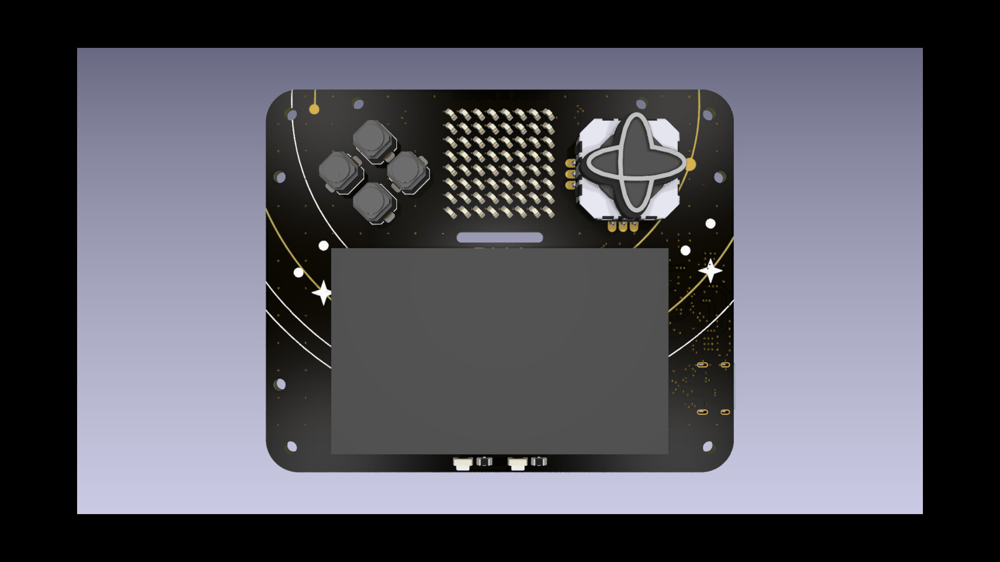

# Replay 2026 Badge Hardware

This directory contains the public hardware design package for the Replay 2026
Badge. It includes KiCad source projects, manufacturing outputs, mechanical
reference files, and exported artwork/renders for the two-board badge assembly.



This package is based on the final released hardware files from 2026-05-14.
Editor state, macOS metadata, KiCad lock files, local history folders, embedded
`.git` folders, and generated caches were intentionally left out.

## Directory Map

```text
hardware/
|-- pcb/
|   |-- PCB-A/            # Main badge KiCad project
|   |-- PCB-B/            # Backplate KiCad project
|   `-- assets/           # Board outlines, dimensional DXF/SVG, support STEP
|-- fab/
|   |-- PCB-A/            # Main-board fabrication and assembly outputs
|   `-- PCB-B/            # Backplate fabrication outputs
|-- cad/                  # Thumbstick mechanical STEP references
`-- assets/               # Badge artwork, renders, and exported board views
```

## Board Projects

`pcb/PCB-A/` is the main electronics board. Open
`pcb/PCB-A/v0-Replay-26_PCB-A.kicad_pro` in KiCad to inspect or modify the
main badge PCB.

Important files:

- `v0-Replay-26_PCB-A.kicad_sch`: schematic.
- `v0-Replay-26_PCB-A.kicad_pcb`: PCB layout.
- `Temporal.kicad_sym`: project symbol library.
- `Temporal.pretty/`: project footprint library.
- `fp-lib-table` and `sym-lib-table`: KiCad library table entries.

`pcb/PCB-B/` is the backplate/art board. Open
`pcb/PCB-B/pcb-backplate.kicad_pro` in KiCad to inspect or modify it.

Important files:

- `pcb-backplate.kicad_sch`: schematic.
- `pcb-backplate.kicad_pcb`: PCB layout.
- `pcb-backplate.step`: exported mechanical model.

## Fabrication Outputs

The `fab/` directory contains production-facing outputs. Review these files
before ordering boards, especially if the KiCad source has changed.

### PCB-A: Main Board

`fab/PCB-A/` includes:

- [`fab/PCB-A/V0-Replay-26_PCB-A_GBR_260331-R3.zip`](fab/PCB-A/V0-Replay-26_PCB-A_GBR_260331-R3.zip): main-board Gerber package.
- [`fab/PCB-A/V0-Replay-26_PCB-A_BOM-260331-R1.csv`](fab/PCB-A/V0-Replay-26_PCB-A_BOM-260331-R1.csv): bill of materials.
- [`fab/PCB-A/V0-Replay-26_PCB-A_CPL-260331-R1.csv`](fab/PCB-A/V0-Replay-26_PCB-A_CPL-260331-R1.csv): component placement list.
- [`fab/PCB-A/JLCPCB/V0-Replay-26_PCB-A_BOM-260331-R2.csv`](fab/PCB-A/JLCPCB/V0-Replay-26_PCB-A_BOM-260331-R2.csv): JLCPCB-oriented BOM.
- [`fab/PCB-A/JLCPCB/V0-Replay-26_PCB-A_CPL-260331-R2.csv`](fab/PCB-A/JLCPCB/V0-Replay-26_PCB-A_CPL-260331-R2.csv): JLCPCB-oriented placement.
- [`fab/PCB-A/Elecrow_PCBA_Quote_Temporal-PCB-A_260331-R0.xlsx`](fab/PCB-A/Elecrow_PCBA_Quote_Temporal-PCB-A_260331-R0.xlsx): reviewed public-safe supplier quote context.

The imported production note records the `GBR-R2` change as an increased via
diameter to 0.3 mm plus silkscreen for the SSD1309 display. The included main
Gerber package is `R3`.

### PCB-B: Backplate

`fab/PCB-B/` includes:

- [`fab/PCB-B/v0-Replay-26_PCB-B_GBR-R0.zip`](fab/PCB-B/v0-Replay-26_PCB-B_GBR-R0.zip): backplate Gerber package.
- [`fab/PCB-B/v0-Replay-26_PCB-B_BOM-R0.csv`](fab/PCB-B/v0-Replay-26_PCB-B_BOM-R0.csv): optional assembly BOM.
- [`fab/PCB-B/v0-Replay-26_PCB-B_CPL-R0.csv`](fab/PCB-B/v0-Replay-26_PCB-B_CPL-R0.csv): optional assembly placement list.

See [`fab/PCB-B/README.md`](fab/PCB-B/README.md) for the backplate fabrication
notes. Public production notes:

- 1.6 mm, 2-layer PCB.
- Matte black solder mask with ENIG finish.
- No sample approval required by the original production note.
- No QA/QC or prep required by the original production note.
- BOM/CPL files were provided only for the case where the backplate is SMT
  assembled with Wurth M2 standoffs. The original plan was to skip that SMT
  assembly step.
- Boards can be depanelized if it saves production time.

## Mechanical And Artwork Assets

`cad/` contains thumbstick STEP references:

- `Temporal-Thumbstick-v3.step`
- `Temporal-Thumbstick-v4.step`
- `Temporal-Thumbstick-v5.step`

`pcb/assets/` contains dimensional drawings and support models, including board
outline DXFs, the CR80 reference outline, LED/display STEP references, and a
FreeCAD source file for the badge dimensions. Some optional per-component 3D
model paths in the PCB-A KiCad project point at placeholders under
`pcb/assets/models/`; the original external library models were not included in
the public release package.

`assets/` contains artwork, renders, SVG layer exports, and board-view images
that are useful for documentation and production review. These are source assets
for the public package; they are not required to build firmware.

Useful previews:

- [`assets/export/v0-Replay-26_PCB-A.png`](assets/export/v0-Replay-26_PCB-A.png)
- [`assets/export/v0-Replay-26_PCB-A-Back.png`](assets/export/v0-Replay-26_PCB-A-Back.png)
- [`assets/export/v0-Replay-26_PCB-B.png`](assets/export/v0-Replay-26_PCB-B.png)
- [`assets/graphics/README.md`](assets/graphics/README.md)
- [`pcb/assets/models/README.md`](pcb/assets/models/README.md)

## Naming

Production files use this pattern:

```text
V0-Replay-26_<board>_<filetype>-<date-or-build>-R<revision>.<ext>
```

Examples:

- `V0-Replay-26_PCB-A_GBR_260331-R3.zip`
- `V0-Replay-26_PCB-A_BOM-260331-R1.csv`
- `v0-Replay-26_PCB-B_GBR-R0.zip`

Common file types:

- `GBR`: Gerber fabrication package.
- `BOM`: bill of materials.
- `CPL`: component placement list.

Keep previous released production revisions unless there is a clear reason to
remove them. When generating new production outputs, increment the revision in
the filename and update this README with the relevant change.

## Maintenance Notes

- Keep KiCad source files and manufacturing packages public-safe.
- Do not commit `.DS_Store`, `__MACOSX`, KiCad lock files, `.kicad_prl`,
  `.history` folders, nested `.git` folders, backup files, private supplier
  notes, or generated caches.
- If PCB source files change, regenerate and review the matching Gerber, BOM,
  CPL, and mechanical exports before publishing a release.
- The repository MIT License covers Temporal-authored hardware source unless a
  file or notice says otherwise.
